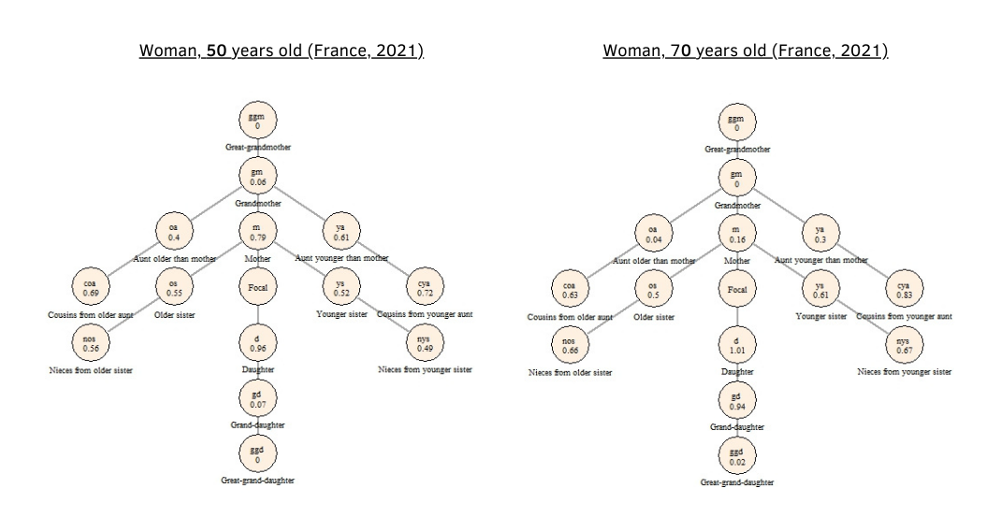
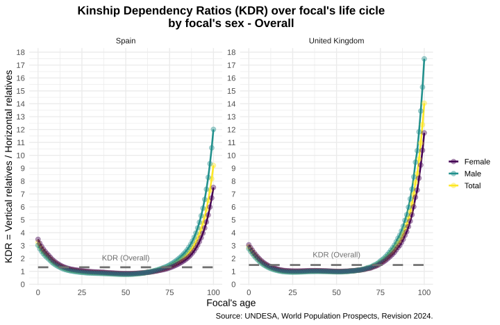
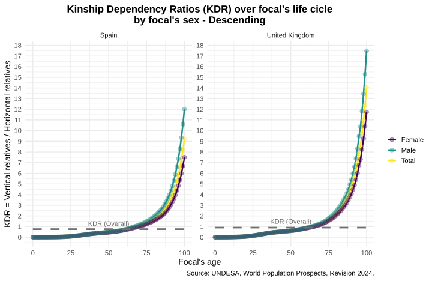
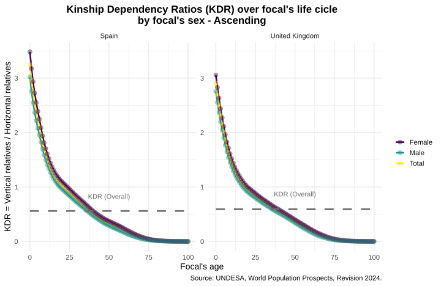

## Motivation (1)

In general, we use the Dependency Ratios (DR) for analysing age-oriented indicators. However (as we saw yesterday), we can extend this idea for different kind of DR.

## Motivation (2)

Thus, we can taking into account a family-oriented indicator to estimate dependency ratio between different kind of relatives. 

```{r caswell-diagram, fig.align='center',fig.cap="Caswell's diagram - France",echo = FALSE, out.width="105%"}



```

It is not something new... different papers have already done for household compositions.

But we can go beyond the household.

## Kinship Dependency Ratio (KDR)

It is the relationship between vertical relatives and horizontal relatives.

-   **Vertical relatives:** ascending relatives (parents, grandparents, great-grandparents, uncle/aunts,...), descending relatives (children, grandchildren, great-grandchildren, *niblings*, ...)

-   **Horizontal relatives:** siblings, cousins.

$$KDR_i (t) = \frac{Vertical_i (t)}{Horizontal_i (t)}$$

## KDR: Spain and the UK - Overall

```{r kdr-overall, fig.align='center',fig.cap="KDR - Overall",echo = FALSE, out.width="105%"}



```

## KDR: Spain and the UK - Descending relatives

```{r kdr-descending, fig.align='center',fig.cap="KDR - Descending",echo = FALSE, out.width="105%"}



```

## KDR: Spain and the UK - Ascending relatives

```{r kdr-ascending, fig.align='center',fig.cap="KDR - Ascending",echo = FALSE, out.width="105%"}



```

